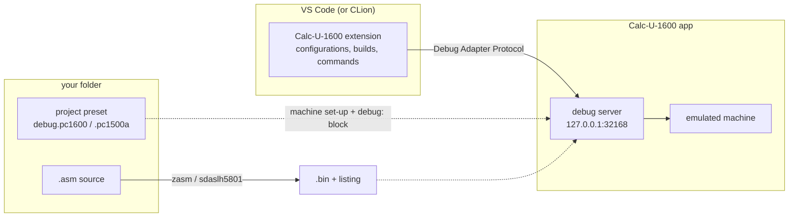
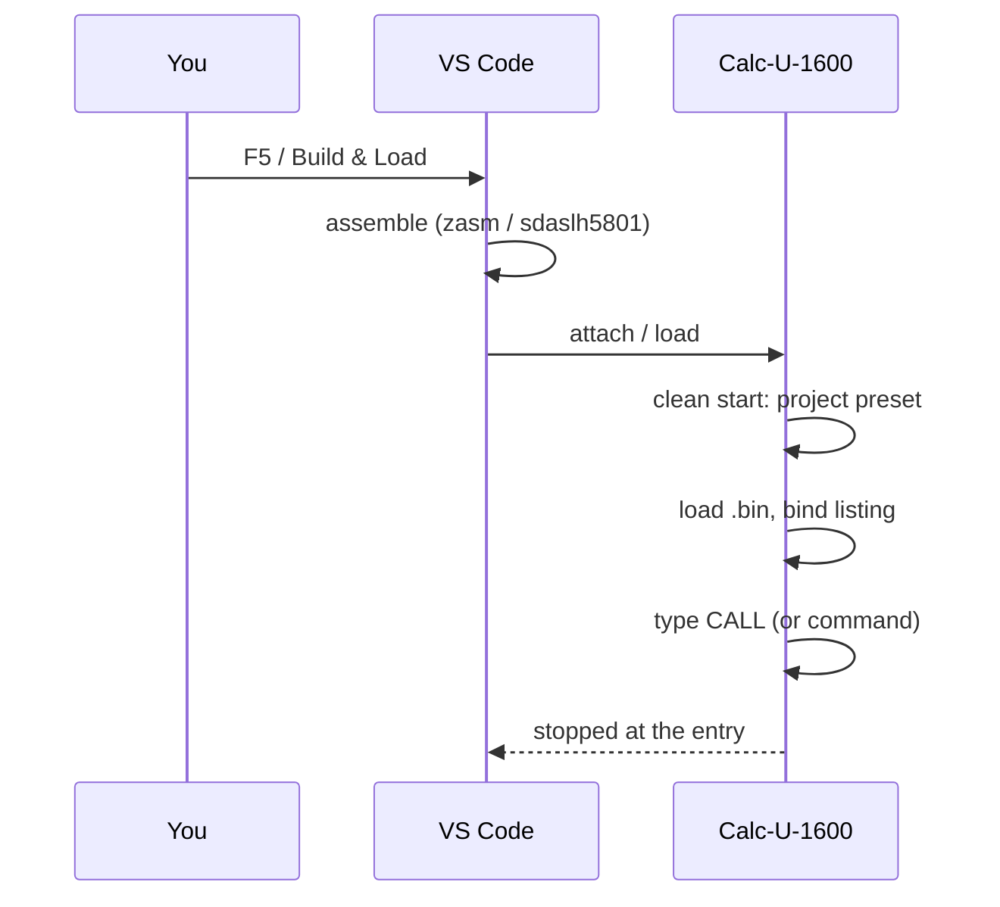
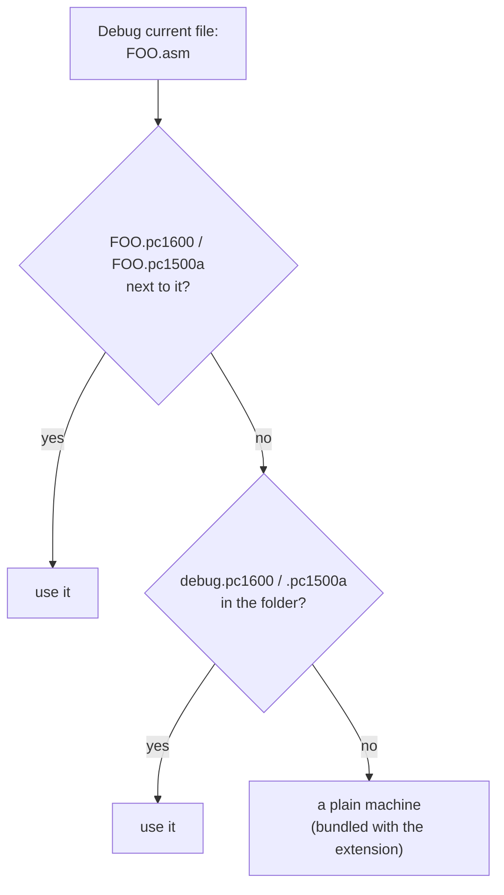
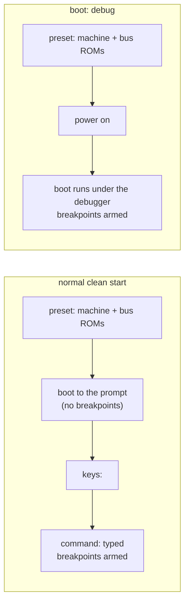

# Debugger

Calc-U-1600 can debug machine code while it runs in the emulator, from VS Code (and, not yet tested, CLion):
- LH5801 code on the PC-1500 / 1500A;
- Z80 (SC7852) and LH5803 code on the PC-1600.

You get breakpoints (with conditions, hit counts and log messages), data breakpoints on memory, stepping by line or by instruction, registers, memory, disassembly, and your `.asm` source.

This manual first covers the one-time installation and setup, then four ways of working:
1. [Developing your own program](#1-developing-your-own-program)
2. [A program found online](#2-a-program-found-online)
3. [Developing a ROM extension](#3-developing-a-rom-extension)
4. [Firmware analysis](#4-firmware-analysis)

The [Reference](#reference) at the end lists the views, breakpoints, expressions and every setting.



---

## One-time installation

**1. Turn the debug server on in the app.** Tick **Settings ▸ Debugger ▸ Accept a debugger**. The default port is 32168, and the dialog shows whether the server is listening. Alternatively, start the app with `--dap 32168`: that turns the server on for that run only.

**2. Install the assemblers.**
- **zasm** ([github.com/Megatokio/zasm](https://github.com/Megatokio/zasm)) for PC-1600 (Z80) code.
- **An SDCC build with the LH5801 assembler** for PC-1500 code: `sdaslh5801`, `sdld` and `makebin`.

The extension finds them on your `PATH`, or where the [settings](#setup) say.

**3. Install the VS Code extension.** From the Calc-U-1600 repository root:

```sh
tools/install_vscode_extension.sh
```

Then reload the VS Code window. Run the script again after updating Calc-U-1600. The extension is installed for your user, so it works in every folder. You don't copy anything into your projects.

**4. Optionally, install a language extension** for LH5801 or Z80 assembly. It adds syntax colouring and lets you set breakpoints by clicking next to a line. Without one, set `"debug.allowBreakpointsEverywhere": true` in your VS Code settings.

---

## Setup

The extension's settings are in VS Code's user settings (**Settings ▸ Extensions ▸ Calc-U-1600 Debugger**, or `settings.json`):

| Setting | What it is | Default |
|---|---|---|
| `calcu1600.port` | the app's debug server port | `32168` |
| `calcu1600.zasmPath` | the zasm executable | `$CALCU_ZASM`, else `zasm` on the `PATH` |
| `calcu1600.sdccBinPath` | the folder with sdaslh5801, sdld and makebin | `$CALCU_SDCC_BIN`, else the `PATH` |
| `calcu1600.romListings` | ROM listings that every session loads | none |
| `calcu1600.romSymbols` | ROM symbol tables that every session loads | none |

**ROM listings** give the firmware source lines and names in every session: you step through the ROM in its disassembly instead of bare instructions, and you can set a breakpoint on a routine by name. The PC-1600 ROM disassemblies in [github.com/tinue/PC-1600-ROM](https://github.com/tinue/PC-1600-ROM/tree/main/disasm) reassemble byte for byte with zasm, which writes the listing:

```sh
zasm -uwy PC1600-P0-B0.asm PC1600-P0-B0.lst PC1600-P0-B0.bin
```

Then list it in your settings with the CPU and the bank it lives in:

```jsonc
"calcu1600.romListings": [
  { "path": "~/PC-1600-ROM/disasm/new/PC1600-P0-B0.lst", "cpu": "z80", "bank": 0 }
]
```

A listing that doesn't match the machine's memory (another ROM version, for example) is reported and not used, so a listing for the other model does no harm.

The PC-1500 ROM disassembly is Jeff Birt's [Sharp_PC-1500_ROM_Disassembly](https://github.com/Jeff-Birt/Sharp_PC-1500_ROM_Disassembly). It is written for TASM, whose listings the debugger can't read yet.

---

## 1. Developing your own program

You work in the program's own folder. *Create Debug Project…* sets it up once, and from then on F5 builds, loads and starts it.

**Create the project.** Open an empty folder in VS Code, then run **Calc-U-1600: Create Debug Project…** from the Command Palette. Choose *PC-1600 program* or *PC-1500A program* and a name. You get:

| File | What it is |
|---|---|
| `main.asm` | a small program that runs: it prints a greeting on the PC-1600, or counts on the PC-1500A |
| `debug.pc1600` or `debug.pc1500a` | the **project preset**: the machine to run on, and a `debug:` block that tells the debugger what to load |
| `.vscode/launch.json` | one configuration, *Debug main*, that points at the project preset and says which file to build |
| `.gitignore` | the build outputs |

The project preset is an ordinary preset, so you can also open it in the app (**File ▸ Load Preset**). The app ignores the `debug:` block when loading it. The PC-1600 one looks like this:

```yaml
model: PC-1600

keys:
  - key: mode
  - type: NEW0
  - key: mode

debug:
  program:
    bin: main.bin
    listing: main.lst
    after: stopOnEntry      # type its CALL and stop at the first line
```

Add memory modules, a plotter or anything else a preset can hold, and every debug session starts on that machine.

**Debug.** Press **F5**. VS Code assembles `main.asm`; problems show in the Problems view. Then the app does a clean start: it applies the project preset, loads the program, types its `CALL` and stops at its first line.

**Change and reload.** After an edit, press **Build & Load** (`Cmd+Alt+L` / `Ctrl+Alt+L`). It rebuilds, does the same clean start and reloads the program without ending the session. Breakpoints move with the code. *Restart* in the debug toolbar sets the machine up again from the configuration.



**Where the program goes.** A headerless `.bin` loads at its listing's lowest address, the source's `.org`. On the PC-1600, where it ends up also follows the calculator's MODE and the program area its `TITLE` selects. The PC-1500A template uses &7C01, the machine-language area BASIC never uses. The PC-1600 template uses C0C5H, the start of the BASIC program area: fine while there is no BASIC program. To keep BASIC off your code, put a `NEW` that reserves it into the preset's `keys:`: on the PC-1500 `NEW &addr` (the first address after your program), on the PC-1600 `NEW "S0:",n` (n bytes from the start of the area). It moves the start of BASIC's program area above your program, so BASIC lines can't overwrite it. The `.org` stays where it is. When you load a program by hand, the app's Load Machine Code shows the exact `NEW` for it.

**LH5803 code on the PC-1600.** LH5801 code can also run on the PC-1600's LH5803. Build it with sdas and give the program `cpu: lh5803` and its LH5803 address. The debugger starts it with `XCALL`, the PC-1600's BASIC command for LH5803 code, and stops on the LH5803 thread.

**Starting it differently.** In the `debug:` block:
- `entry: START` starts at a symbol (or an address) instead of the default;
- `command: CALL &C0C5,X` types that line instead of the plain `CALL`, e.g. to pass a variable to the program;
- `after: call` starts the program without stopping; `after: none` only loads it.

---

## 2. A program found online

You collect programs (typically `.bin` files) in one folder, have an AI agent disassemble each into an `.asm` file, and then want to step through them. You don't want a configuration per program.

**Debug the file in the editor.** Open the folder, open one `.asm` file, and pick *Debug current file on PC-1600 (zasm)* or *… on PC-1500A (sdas)* from the Run and Debug view's list (under *Calc-U-1600*); they are there in every folder. Pressing **F5** in a folder without a `launch.json` offers the same choices (if VS Code first asks which debugger, choose *Calc-U-1600*). The session assembles the file, loads it at its `.org` into a plain machine, and stops at its first instruction, or at `ENTRY` if the source defines that label.

**Give one program its own machine.** Some programs need more than a plain machine: a memory module, a plotter, their data, or a `NEW` that reserves their memory. Put a preset with the program's name next to it: `DATABROS.pc1600` next to `DATABROS.asm`. *Debug current file* uses the first preset it finds:



**Tips for disassembled code.**
- Ask the agent to keep the original load address as `.org` and to label the entry point `ENTRY`.
- **Don't overwrite the original.** The build writes `<name>.bin` next to the source. On a Mac disk, `DATABROS.bin` and `DATABROS.BIN` are the same file, so building `DATABROS.asm` next to the original `DATABROS.BIN` replaces it. Give the disassembly its own name (`DATABROS-dis.asm`) or keep it in a subfolder, then compare the rebuilt `.bin` with the original to check that the disassembly is complete.
- Build & Load assembles the file the session started with, even if another file is in focus.

---

## 3. Developing a ROM extension

A ROM extension (like Calc-U-1600's own host-drive ROM) isn't loaded into RAM and called. It is plugged into the machine before power-on, and its code runs from the ROM's own module handling or from BASIC commands. The debugger supports that too.

**Create the project.** **Calc-U-1600: Create Debug Project…** offers two ROM targets:

| Target | What you get |
|---|---|
| *PC-1600 ROM extension* | a minimal ROM module (ID, jump table, reset entry) in page 1, bank 6 of the 60-pin bus, built with zasm |
| *PC-1500 ROM extension* | a minimal ROM at &8000 on the 60-pin bus, built with sdaslh5801. It is entered with `CALL &8000`, just to show the mechanics |

**Plugging the ROM in.** The project preset's `bus-rom:` puts your `.bin` on the bus:

```yaml
model: PC-1600

bus-rom:
  - file: rom.bin
    bank: 6                 # PC-1600 system bus: page 1 (4000H-7FFFH), bank 4-7

debug:
  boot: debug
  listings:
    - path: rom.lst
      cpu: z80
      bank: 6
```

On the PC-1500 (or the PC-1600's LH5803 side), a bus ROM has an `address:` instead of a `bank:`, and it can be limited to one PV / PU state with `pv:` / `pu:`, like the CE-158's ROM. Each clean start reads the file again, so F5 and Build & Load always run your latest build. The app doesn't need restarting.

**Replacing a bundled ROM.** A bus ROM takes precedence over a built-in device's ROM at the same place. To work on a new version of the host-drive ROM, for example:

```yaml
model: PC-1600
host-drive: files           # the drive itself: its I/O stays the app's
bus-rom:
  - file: build/hostdrive.bin
    bank: 7                 # your build replaces the bundled bank-7 ROM
```

**Getting into the code.** A real ROM extension is rarely called directly. It usually adds BASIC commands: the firmware finds the extension at power-on, activates its commands, and the commands run the extension's machine code. The `debug:` block has two ways to reach that code:
- **`command:`** types a BASIC line once the machine is up: one of your new commands, `FILES "S3:"` for a file device, or `CALL &8000` for the minimal template. Set a breakpoint in the code behind it, press F5, and it stops there.
- **`boot: debug`** runs the power-on under the debugger. The preset only sets the machine up; then the debugger switches it on, with your breakpoints armed. That's how you debug a module's reset or initialisation, which runs before BASIC's prompt appears. The preset's `keys:` are skipped in this mode, and a `program` or `command` is refused.



**Build & Load** in a ROM project rebuilds the ROM and does the whole set-up again: power-on with the new ROM, listings read again, `command` typed (or the boot run under the debugger).

**ROM modules in a memory slot.** A ROM in a memory module (a PC-1500 module slot, or PC-1600 slot S1/S2) is a card definition (`.card.yaml`, see [Memory-Card-Definition-Format.md](Memory-Card-Definition-Format.md)) whose ROM content comes from your `.bin`:

```yaml
    initial-content:
      blocks:
        - offset: 0x0000
          encoding: file
          path: build/module.bin    # relative to the .card.yaml; read at every load
```

Plug it in with `slot-1-file: module.card.yaml` (or `slot-2-file:` on the PC-1600) in the project preset. A ROM's content must cover the whole ROM, so pad the binary to its full size. There is no template for slot modules yet.

---

## 4. Firmware analysis

You study the calculator's own ROM, in any folder.

**Reset and stop.** Run the ready-made configuration *Calc-U-1600: Reset and stop*. It uses whatever machine the app has open, resets it and stops before the first instruction: E000 on the PC-1500, 0000 on the PC-1600's Z80. Step from there, or set breakpoints and continue. **Reset & Stop** and **All Reset & Stop** in the Command Palette, and *Restart* in the debug toolbar, do the same during a session.

**With source.** With the [ROM listings](#setup) in your settings, you step through the disassembly's source, and you can set a function breakpoint on a routine by name (`SCANMODS`, say). Listings of banked ROM need their bank qualifier (`bank:` on the PC-1600, `pv:` / `pu:` on an LH580x), so a breakpoint in them stops only while that bank is selected.

**A particular machine.** To study the firmware with a plotter, a module or a floppy attached, give the configuration a preset. Add a configuration to the folder's `launch.json`:

```jsonc
{
  "type": "calcu1600", "request": "attach", "name": "Firmware with CE-1600P",
  "preset": "${workspaceFolder}/with-plotter.pc1600",
  "reset": "reset", "stopOnEntry": true
}
```

---

## CLion

> Not tried yet. CLion 2026.1 and later can use DAP debuggers, including over TCP. The recipe below follows JetBrains' documentation; please report what works.

CLion sets DAP debuggers up per IDE, not per project. Use a project preset (as in use cases 1 and 3), so that everything project-specific lives in the project:

1. **Settings ▸ Build, Execution, Deployment ▸ Debugger ▸ DAP Debuggers:** add *Calc-U-1600*.
   - Connection: TCP, port 32168.
   - Executable: the Calc-U-1600 app with the arguments `--dap $DebuggerPort$`, so that CLion starts the emulator for the session. Alternatively, use a placeholder executable, if CLion accepts one, to connect to an app that is already running.
   - Launch parameters: `{"project": "$WorkingDir$/debug.pc1600"}`. Attach parameters: the same.
2. **Settings ▸ Build, Execution, Deployment ▸ Toolchains:** a toolchain whose debugger is *Calc-U-1600*.
3. **A run configuration** (*Custom Build Application*) with the project folder as working directory and the build as a *Before launch* external tool: `zasm -uwy main.asm main.lst main.bin`, or the sdas commands.

CLion has none of the extension's commands. Restarting the session does what Build & Load does: build, clean start, load.

What to check:
- does CLion connect to a server it didn't start;
- does it allow breakpoints in `.asm` files;
- does `$WorkingDir$` expand in the launch parameters;
- does the build run before each session.

---

## Reference

### What you see in VS Code

- **Call Stack:** one thread per CPU: `LH5801` on the PC-1500; `Z80 (SC7852)` and `LH5803` on the PC-1600, where the CPU that owns the bus is marked `[bus]`. A stop always stops both CPUs and names the one that caused it.
  - **Frame 0** is the live state.
  - **Frames 1–20** are the last 20 instructions that CPU executed, newest first, e.g. `after C0EE  call KEYGET`. Each shows its registers *after* it ran, and its source line if it has one. An interrupt shows as `interrupt at …`. The history is always recorded, so it is there even when you attach after something went wrong.
- **Variables ▸ Registers:** the selected frame's registers, plus *Flags* and, for the live frame, *Banks* (PC-1600 page banks, or PU/PV).
- **Disassembly:** right-click a frame ▸ **Open Disassembly View**. It opens by itself where there's no source.
- **Memory:** VS Code shows memory in Microsoft's Hex Editor extension (`ms-vscode.hexeditor`), which it offers to install the first time.
  - **Open it:** while paused, hover over a 16-bit register or a Watch entry and click **View Binary Data**. A Watch entry can be any address or expression, e.g. `0x7600` or `x+0x10`.
  - **Offsets** count from the address you opened. To see real addresses, open it from a Watch entry `0`; then **Cmd+G** (Go to offset) jumps anywhere.
  - **Edit** in *Replace* mode (status bar, or **Hex Editor: Switch Edit Mode**), then save (**Cmd+S**). An insert or a delete can't be saved; undo it with **File: Revert File**.
  - **Which CPU:** memory opens as the selected frame's CPU sees it. Select an LH5803 frame to see the PC-1600's LH5803 side.
  - Device registers that a read would disturb (the UART, a card's I/O window) show as unreadable.
- **Title bar:** the app shows *Paused (debugger)* while the machine is stopped.

### Stepping

- **Step into / over / out** work by source line. In the Disassembly view they work by instruction.
- **Step over** a call (`SJP`, `VEJ`, `VMJ`, `CALL`, `RST` and the conditional forms) runs until the stack is back where it was, even when a `VMJ`'s inline parameters move the return address.
- **Step out** runs until a return (`RTN`, `RTI`, `RET` …) leaves the current routine.
- A long step (over a slow ROM call) keeps the app responsive.

### Breakpoints and expressions

- **Source, function and instruction breakpoints** take a condition (`a == 0x10 && [0x7A00] != 0`), a hit count (`5`, `>= 5`, `% 3`) and a log message (`x={x}`).
- **Function breakpoints** name a symbol from a listing or symbol table, and stop on the CPU that listing belongs to, only while its bank qualifier holds.
- **Data breakpoints** watch memory reads and/or writes. Instruction fetches don't trigger them. The machine stops right after the instruction that made the access. Registers can't be watched; use a conditional breakpoint.
- **Breakpoints stop only while the debugger runs the machine.** A preset, a load or a normal boot never stops on one. Use `boot: debug` for code that runs at power-on.
- **Expressions** (conditions, Watch, hovers, the Debug Console, register edits) accept registers and flags (`cf`, `zf` …), listing symbols, `[addr]` (byte), `w[addr]` (word, in the CPU's byte order), `#[addr]` (a byte of an LH580x's ME1), and C operators.

### Listings

- **Formats:** sdaslh5801 / sdasz80 `.lst` and the `.rst` sdld writes (prefer the `.rst` for relocatable code), zasm `.lst` (`zasm -uwy`), and `.SYMBOLS:` tables (`HHHH name` per line).
- **Keep the sources next to the listing.** Neither assembler names the file an included line comes from; the debugger finds each line in the source files by its text.
- **Checked against memory.** A listing whose bytes don't match memory is reported and not used for source: the wrong build, or another ROM version. A frame whose bytes no longer match its line (self-modifying code) shows as disassembly.
- **Bank qualifiers** tie a listing, and its breakpoints, to a memory state:

| Qualifier | Meaning |
|---|---|
| `bank` | PC-1600 Z80: the page bank 0–7 selected for the address |
| `me` | LH580x: ME0 or ME1 (code always runs from ME0, so `me: 1` is for data) |
| `pu`, `pv` | LH580x: the PU / PV flip-flops, for code in banked ROMs |

### The `debug:` block and launch configurations

A launch configuration and a project preset's `debug:` block take the same keys. With `project`, the block supplies whatever the launch configuration leaves out, and the configuration's own keys win (`program` merges key by key). The project is read again at every restart and Build & Load.

Numbers (`address`, `entry`, `bank`, `me`, `pu`, `pv`) follow the preset rule in both places: `&`, `0x` or `$` makes a number hex, a bare number is decimal. So `address: &C0C5` and `"address": "0xC0C5"` are the same address; `C0C5` without a prefix is refused (for `entry` it can still be a symbol). A launch configuration may also give a plain JSON number, which is decimal.

| Key | Meaning |
|---|---|
| `project` | (launch configuration only) a project preset: it sets the machine up, and its `debug:` block gives the rest |
| `preset` | a preset for the clean start; default: the model's default preset from Settings, else All Reset |
| `program` | the program to load: `bin`, `listing`, `source` (if the main source isn't `<listing>.asm`), `symbols`, `cpu` (`lh5801` / `z80` / `lh5803`), `address`, `entry`, `after` (`stopOnEntry` / `call` / `none`), `cleanStart` (default `true`), bank qualifiers |
| `listings` | listings of code that isn't loaded (ROM): a path, or `{path, source, cpu, bank, me, pu, pv}` |
| `symbols` | `.SYMBOLS:` tables: a path, or `{path, cpu, bank, me, pu, pv}` |
| `command` | a BASIC line typed to start the code: in place of the program's `CALL`, or, without a program, once the machine is set up |
| `boot` | `debug`: run the power-on under the debugger (the preset's hardware only; no `program` or `command`) |
| `reset` | `reset` / `allReset`: reset without the boot, and start at the reset vector |
| `stopOnEntry` | stop right after attaching (after a reset: before the first instruction) |

The VS Code extension adds these keys:

| Key | Meaning |
|---|---|
| `build` | `{assembler: zasm \| sdas, file}`: assemble this file before the session and on Build & Load |
| `buildTask` | a task to run instead, e.g. a Makefile target from `tasks.json` |
| `currentFile` | `pc1600` / `pc1500a`: debug the `.asm` in the editor (use case 2) |
| `port` | the server port, if not `calcu1600.port` |

The preset keys for ROM development, `bus-rom:` and `debug:`, are listed with the other preset keys in the [User Guide](User-Guide.md).

### Limitations

- The PC-1600's vertical banks (port 28H, module banks 1 and up) can't be used as a bank qualifier.
- ME1 can't be written from the debugger; on both machines it is I/O.
- No stepping backwards.
- The zasm problem matcher shows the first error of each file in the Problems view; the terminal shows all of them.
- TASM listings (such as the PC-1500 ROM disassembly) can't be read yet.
- One debugger at a time: a second session is refused while one is attached. **Settings ▸ Debugger ▸ Disconnect** drops the attached one.
