# Calc-U-1600 User Guide

Calc-U-1600 emulates three Sharp pocket computers in one desktop app: the
**PC-1500**, the **PC-1500A** and the **PC-1600**. Around them it emulates
the memory modules, the CE-150 and CE-1600P plotters, the CE-1600F floppy
drive and the CE-158 interface, and it connects the calculators' serial
ports to your computer.

This guide starts with the basics and gets more technical as it goes:

1. [Introduction](#1-introduction)
2. [Getting started](#2-getting-started)
3. [Plotters](#3-plotters)
4. [Loading a BASIC program](#4-loading-a-basic-program)
5. [Memory modules and floppy disks](#5-memory-modules-and-floppy-disks)
6. [Machine-code programs](#6-machine-code-programs)
7. [COM ports](#7-com-ports)
8. [Presets](#8-presets)
9. [Appendix](#9-appendix): Settings, Debug panel, custom memory cards

The screenshots are taken from macOS. They are generated by scripts, so they
stay up to date with the app (see [screenshots/README.md](screenshots/README.md)).

---

## 1. Introduction

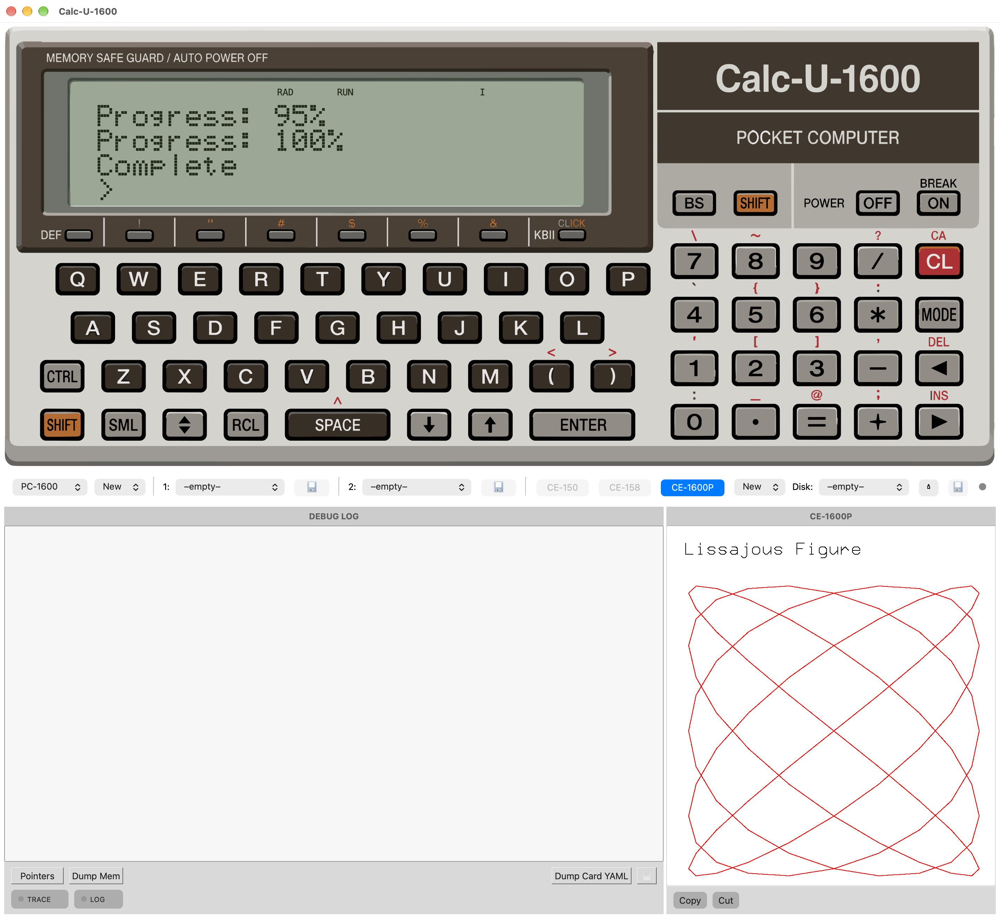

The window has three parts:
- **The calculator** (faceplate and LCD) at the top.
- **The control bar** below it: model and ROM, memory slots and peripherals.
- **The panels** at the bottom: the Debug panel, plus the plotter paper or
  the CE-158 printer output when one is attached.

Everything you can plug into a real machine, the emulator can plug in too:

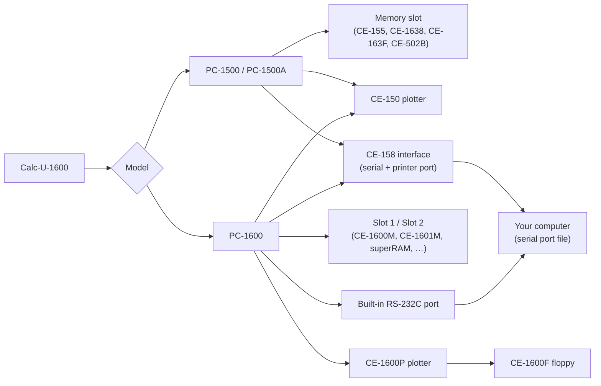
```mermaid
flowchart LR
    App["Calc-U-1600"] --> Model{"Model"}
    Model --> P15["PC-1500 / PC-1500A"]
    Model --> P16["PC-1600"]
    P15 --> S["Memory slot<br/>(CE-155, CE-1638, CE-163F, CE-502B)"]
    P15 --> C150["CE-150 plotter"]
    P15 --> C158["CE-158 interface<br/>(serial + printer port)"]
    P16 --> S1["Slot 1 / Slot 2<br/>(CE-1600M, CE-1601M, superRAM, …)"]
    P16 --> C16P["CE-1600P plotter"] --> C16F["CE-1600F floppy"]
    P16 --> C150
    P16 --> C158
    P16 --> COM["Built-in RS-232C port"]
    C158 --> Host["Your computer<br/>(serial port file)"]
    COM --> Host
```

---

## 2. Getting started

The app starts straight into BASIC on the model you used last. There is no
separate "power on" step.

### Choosing a model

Pick the model in the control bar's first drop-down, or in **Machine ▸
Model**:

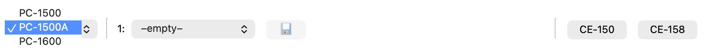

A model switch always gives you a fresh machine, with no modules and no
peripherals. If you have set a default preset for that model (see
[Startup presets](#88-startup-presets)), it is applied straight after the
switch.

### ROM choices

The control bar shows the ROM choices the current model has:

- **PC-1500:** ROM revision A01, A03 or A04 (default). The PC-1500A always
  runs its one ROM.

  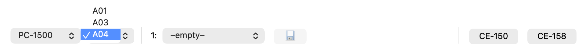

- **PC-1600:** the BASIC ROM, **New** or **Old**, next to the model. A second
  New/Old picker, after the CE-1600P button, selects the CE-1600P ROM. The
  CE-1600F floppy drive uses that ROM too.

  

### Reset and Reset All

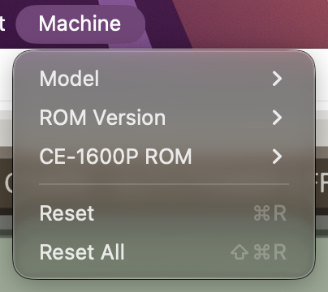

- **Reset** (⌘R / Ctrl-R) is the real machine's reset button. Memory and the
  BASIC program are kept.
- **Reset All** (⇧⌘R / Ctrl-Shift-R) is the PC-1600's deeper ALL RESET. The
  PC-1500/1500A have no ALL RESET of their own; there it clears all RAM,
  like taking the batteries out.

Both run the boot at full speed until the prompt appears, then set the
calculator's clock from your computer.

### Keyboard and faceplate

Your computer's keyboard drives the calculator directly:

- **Letters, digits, `+ - * / ( ) . =`**, **Space**, **Enter/Return**
  (ENTER) and the **arrow keys** type as you'd expect.
- **Backspace** is the calculator's delete-left key.
- **F1–F6** are the six function keys.
- **Tab** is MODE (RUN/PRO).
- **Delete** is CL; **Shift+Delete** is Shift+CL.
- A punctuation character that the calculator has as a second legend
  (`!`, `#`, `@`, …) types directly; you don't have to press the
  calculator's SHIFT first.
- **Shift tapped on its own** taps the calculator's SHIFT, for the next key.
- Anything held with **⌘/Ctrl** (Windows/Linux: Ctrl, Alt, Windows key) is a
  shortcut and never reaches the calculator.

The complete table, including the keys that exist only on an external
PC-style keyboard, is in [Keyboard-Mapping.md](Keyboard-Mapping.md).

You can also click the faceplate. A key stays pressed while you hold the
mouse button and lights up; below, SHIFT is held and the LCD shows the
SHIFT symbol:

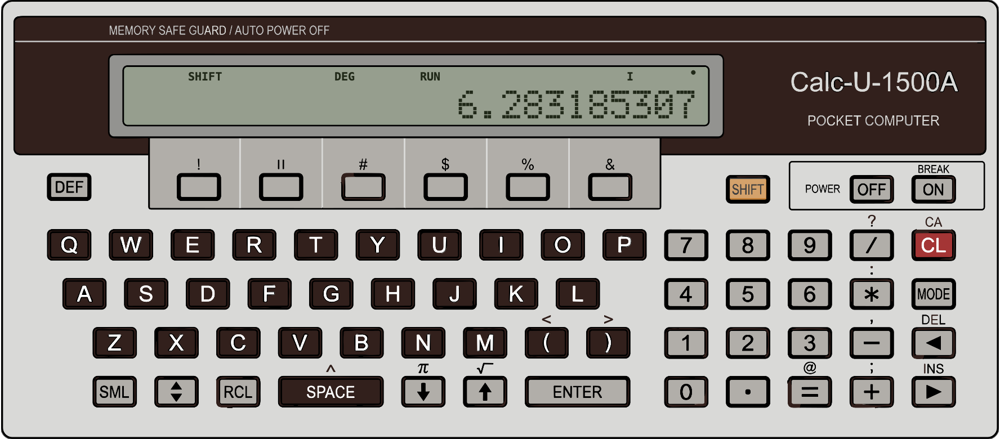

### Copy Screen and Paste Text

- **Edit ▸ Copy Screen** (⌘C / Ctrl-C) puts the LCD's dot matrix on the
  clipboard as an image, at the real display's physical size. Here is a
  PC-1600 LCD, as it gets pasted:

  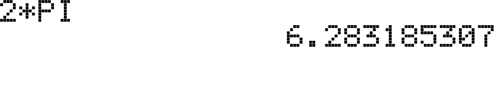

- **Edit ▸ Paste Text** (⌘V / Ctrl-V) types the clipboard's **first line**
  into the calculator, key by key. It stops at the line break and doesn't
  press ENTER, so you can check the line before running it. For whole
  programs, see [Loading a BASIC program](#4-loading-a-basic-program).

---

## 3. Plotters

The **CE-150** (PC-1500, 1500A and PC-1600) and the **CE-1600P** (PC-1600
only) are pen plotters. They are attached and detached with their control-bar
buttons. Only one plotter can be attached at a time. The emulator also
doesn't support the CE-1600P together with the CE-158 yet. The real
CE-1600P has its own connector at the back, like the CE-150, so both could
be connected:


On a real machine the ROM only notices a new peripheral when it powers on,
so clicking a button runs a power cycle:

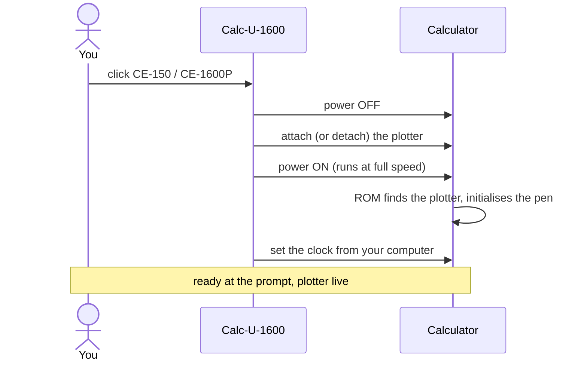
```mermaid
sequenceDiagram
    actor You
    participant App as Calc-U-1600
    participant M as Calculator
    You->>App: click CE-150 / CE-1600P
    App->>M: power OFF
    App->>M: attach (or detach) the plotter
    App->>M: power ON (runs at full speed)
    M->>M: ROM finds the plotter, initialises the pen
    App->>M: set the clock from your computer
    Note over You,M: ready at the prompt, plotter live
```

While a plotter is attached, its paper appears next to the Debug panel. The
paper scrolls, and it follows the pen as long as you are at the bottom:

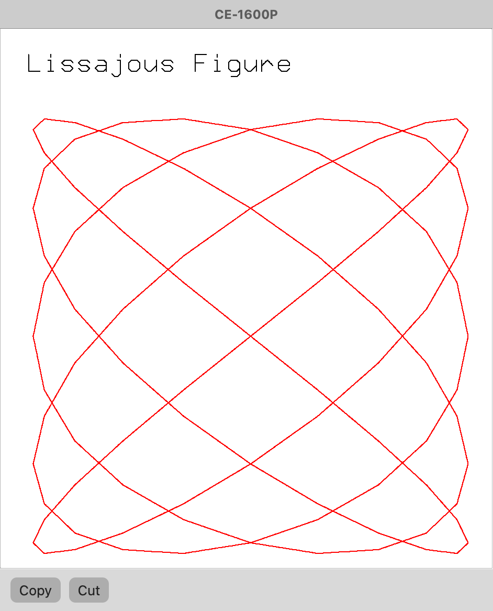

- **Copy** puts the whole plot on the clipboard at its physical size, in high
  resolution, ready to paste or print:

  

- **Cut** copies the plot, then tears off the paper, so the next plot starts
  on a clean sheet.

---

## 4. Loading a BASIC program

**File ▸ Load BASIC Program…** opens a plain-text BASIC listing (`.bas`),
converts it to BASIC's internal form, and writes it straight into the
program memory. It behaves like the real `LOAD`: it doesn't reset the
machine, change the mode, or run `NEW` for you. So prepare the machine the
same way you would for `LOAD`:

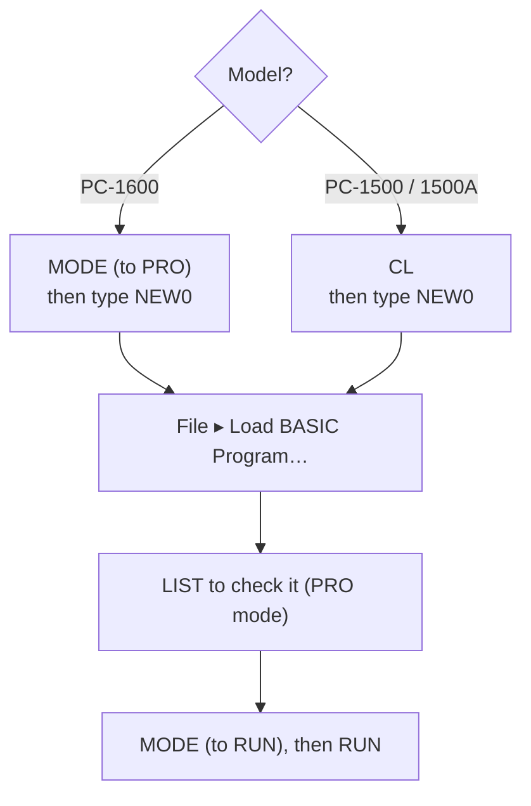
```mermaid
flowchart TD
    A{"Model?"} -->|PC-1600| B["MODE (to PRO)<br/>then type NEW0"]
    A -->|PC-1500 / 1500A| C["CL<br/>then type NEW0"]
    B --> D["File ▸ Load BASIC Program…"]
    C --> D
    D --> E["LIST to check it (PRO mode)"]
    E --> F["MODE (to RUN), then RUN"]
```

Right after loading, `LIST` in PRO mode shows the program:

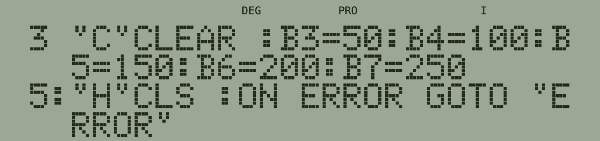

and `RUN` starts it:

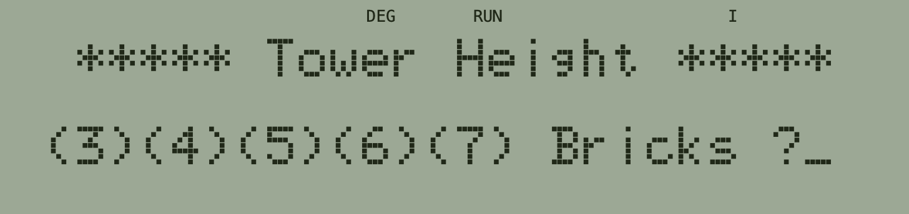

Good to know:
- **Where the program goes.** It goes to the same place a `LOAD` would put
  it. On a PC-1600 with a RAM module that holds BASIC's program area, it
  starts in the module and continues in internal RAM.
- **Single lines.** **Edit ▸ Paste Text** types one line from the clipboard
  without pressing ENTER (see [Getting started](#copy-screen-and-paste-text)).
  That's handy for a long command or one program line, but not for a whole
  program.
- **No export.** The app doesn't export programs as files. Use the machine's
  own `SAVE` to a memory module, a floppy, or over `COM1:` to your computer
  (see [COM ports](#7-com-ports)).

---

## 5. Memory modules and floppy disks

### The slot pickers

Each memory slot has a picker in the control bar. The PC-1500/1500A have one
slot; the PC-1600 has two. A picker lists, from the top:

- **–empty–**
- The **templates**: the bundled modules that fit this slot, plus any
  templates of your own.
- After a separator, **your saved modules** (here: "My programs").
- After a separator, **ROM modules**.

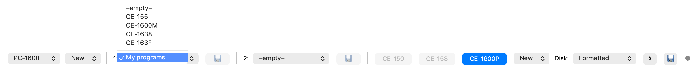

Choosing an entry plugs the module in immediately. This restarts the
machine, like a model switch does.

| Module | Models | What it is | Battery-backed |
|---|---|---|---|
| CE-155 | PC-1500/1500A, PC-1600 Slot 1 | 8 KB RAM | no |
| CE-1638 | PC-1500/1500A, PC-1600 | 128 KB banked RAM (hobbyist module) | yes |
| CE-163F | PC-1500/1500A, PC-1600 | 128 KB RAM + 128 KB flash (hobbyist module) | yes |
| CE-502B | PC-1500/1500A | "Statistics" program module (ROM) | – |
| CE-1600M | PC-1600 Slot 1 or 2 | 32 KB RAM | yes |
| CE-1601M | PC-1600 Slot 2 | 64 KB banked RAM | yes |
| superRAM | PC-1600 Slot 2 | 512 KB banked RAM (fictional, fully loaded Slot 2) | yes |

### The floppy disk (PC-1600)

The CE-1600F floppy drive comes with the CE-1600P: attaching the plotter
attaches the drive. Its row in the control bar has:

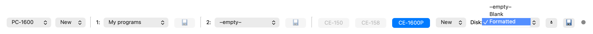

- **Disk:** –empty– (no disk), **Blank** (unformatted), **Formatted**
  (ready to use), then your saved disks.
- **A/B** turns the disk over (eject, flip, reinsert).
- **Save** (disk icon): Name & Save, as for modules (see below).
- **The lamp** lights while the drive is busy. Wait for it to go dark before
  turning the disk over.

### Naming and saving

The bundled modules and disks are **templates**, and templates are never
written to. For a battery-backed module or a disk, **Name & Save** (the save
icon next to the picker) turns what's in the slot into your own named
copy:

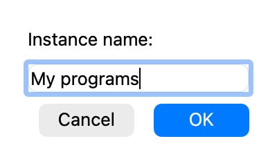

From then on that copy **saves itself**: about half a second after a
change, the file is updated. It appears in the picker below the separator,
so you can plug it in again later, and presets can use it by name.

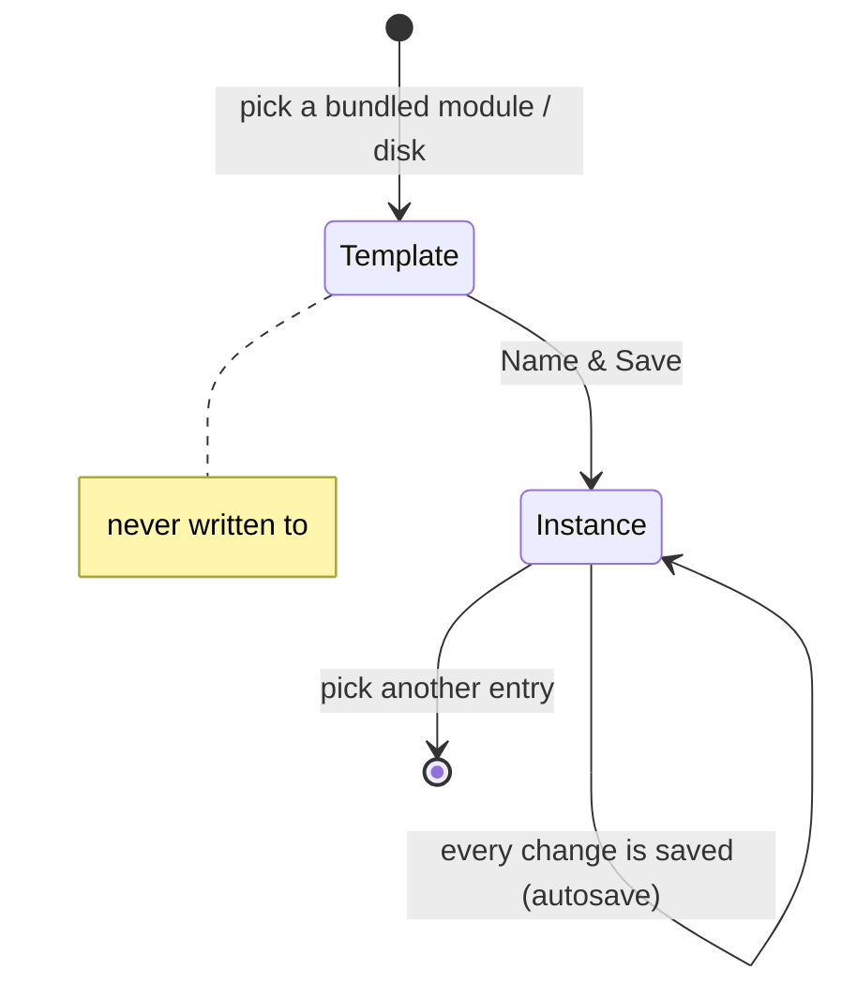
```mermaid
stateDiagram-v2
    [*] --> Template: pick a bundled module / disk
    Template --> Instance: Name & Save
    Instance --> Instance: every change is saved (autosave)
    Instance --> [*]: pick another entry
    note right of Template: never written to
```

- **Where the files go.** Modules are saved as `<name>.card.yaml`, disks as
  `<name>.floppy.yaml`, in **Settings ▸ Storage ▸ Battery-card saves**
  (default `~/Calc-U-1600`). A `/` or `:` in the name becomes `-`.
- **Editing a saved disk file.** If you want to change a saved disk's file
  with another program, pick –empty– first, so the emulator doesn't
  overwrite your edit.

---

## 6. Machine-code programs

**File ▸ Load Machine Code…** opens a `.bin` file and writes it into the
calculator's memory. It never runs the code. What happens next depends on
the file:

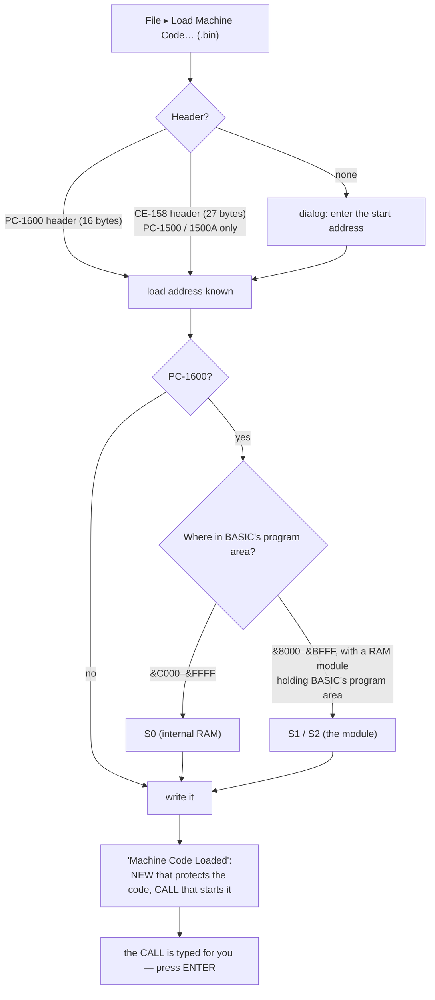
```mermaid
flowchart TD
    F["File ▸ Load Machine Code… (.bin)"] --> H{"Header?"}
    H -->|"PC-1600 header (16 bytes)"| A["load address known"]
    H -->|"CE-158 header (27 bytes)<br/>PC-1500 / 1500A only"| A
    H -->|none| D["dialog: enter the start address"]
    D --> A
    A --> P{"PC-1600?"}
    P -->|no| L["write it"]
    P -->|yes| S{"Where in BASIC's program area?"}
    S -->|"&C000–&FFFF"| S0["S0 (internal RAM)"] --> L
    S -->|"&8000–&BFFF, with a RAM module<br/>holding BASIC's program area"| S12["S1 / S2 (the module)"] --> L
    L --> B["'Machine Code Loaded':<br/>NEW that protects the code, CALL that starts it"]
    B --> C["the CALL is typed for you — press ENTER"]
```

A file without a header needs a start address:

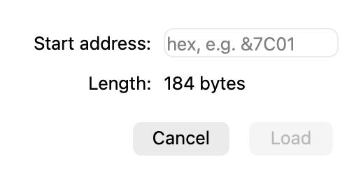

After loading, the app tells you two things:
- which `NEW` keeps BASIC from overwriting the code;
- how to start it. The `CALL` is already typed on the calculator, so you
  only have to press ENTER.

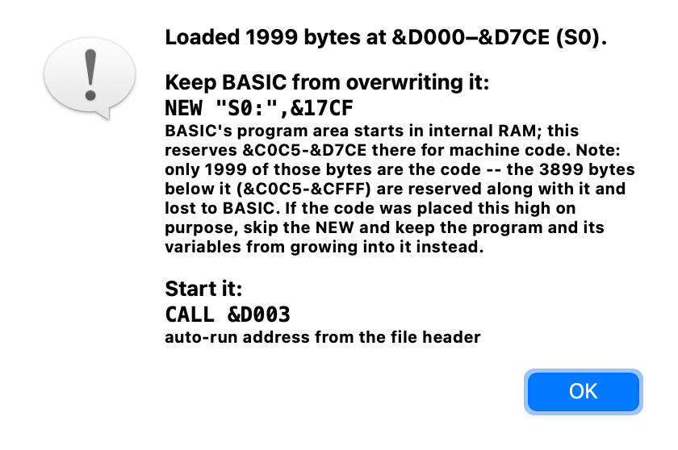

To load code into a program module or a RAM disk, or to load several files
in one go, use a preset (see [Machine code in a preset](#86-machine-code)).

**Debugging.** With **Settings ▸ Debugger** turned on, VS Code can attach
to the emulator and debug the program. It can build, load and start the
program; stop at breakpoints in your `.asm` source; step through it; and
show registers and memory. It also works for ROM code. See
[Debugger.md](Debugger.md).

---

## 7. COM ports

The emulator connects the calculators' serial ports to **serial port files**
on your computer. These are pseudo-terminals that any serial program can
open like a real port:

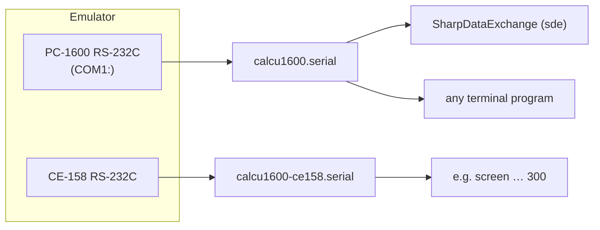
```mermaid
flowchart LR
    subgraph Emulator
      U16["PC-1600 RS-232C<br/>(COM1:)"]
      U158["CE-158 RS-232C"]
    end
    U16 --> L1["calcu1600.serial"]
    U158 --> L2["calcu1600-ce158.serial"]
    L1 --> SDE["SharpDataExchange (sde)"]
    L1 --> T["any terminal program"]
    L2 --> SCR["e.g. screen … 300"]
```

Both files are in **Settings ▸ Serial ports ▸ Symlink directory** (default
`~/Calc-U-1600`). The Settings dialog also shows their full paths while the
ports are open:

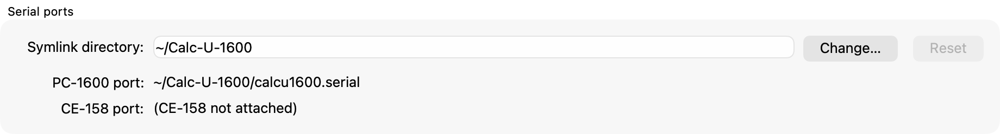

Serial ports work on macOS and Linux; on Windows they are not available yet.

### PC-1600: the built-in RS-232C port

The port is always on while a PC-1600 is running. Set it up on the
calculator once after each power-on or reset:

```basic
SETCOM "COM1:",9600,8,N,1,N,N
INIT "COM1:",4096
OUTSTAT "COM1:"
RCVSTAT "COM1:",28
SNDSTAT "COM1:",28
```

This is 9600 baud, 8 bits, no parity, 1 stop bit, and **no handshake**. XON/XOFF
(`…,X,N`) doesn't work well here: the control characters simply become
part of the data, because no driver on the computer side reacts to them.
`28` switches the handshake-line checks off.

**Exchanging programs with SharpDataExchange**
([github.com/tinue/SharpDataExchange](https://github.com/tinue/SharpDataExchange)):

```sh
# computer → PC-1600: start LOAD "COM1:" on the calculator, then
sde put myprogram.bas --device pc1600emul --port ~/Calc-U-1600/calcu1600.serial

# PC-1600 → computer: start this first, then SAVE "COM1:" on the calculator
sde get myprogram.bas --device pc1600emul --port ~/Calc-U-1600/calcu1600.serial
```

To avoid typing `--port` every time, store the folder once:
`sde config set pc1600emul.port ~/Calc-U-1600`. sde's own default is
`/tmp`, which is not where the emulator puts the file.

### CE-158: serial and printer port

The **CE-158** button attaches the CE-158 interface, with a power cycle
like the plotters. It works on all three models. The emulator doesn't
support it together with the CE-1600P yet.

- **Serial port:** `calcu1600-ce158.serial` runs at 300 baud by default,
  for example `screen ~/Calc-U-1600/calcu1600-ce158.serial 300`.
- **Printer port:** whatever the program prints on the parallel port
  (`OPN "LPRT"`, then `LPRINT`) appears in the CE-158 panel. **Save…**
  writes it to a file exactly as sent; **Clear** starts a new sheet.

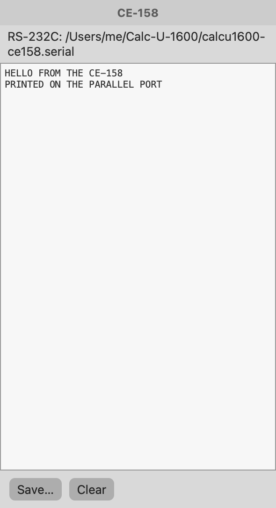

In BASIC:
- `OPN "LPRT"` sends `LPRINT` to the printer port, and `OPN` alone switches
  it back.
- `SETDEV PO` sends `LPRINT`/`LLIST` to the serial port instead, and
  `SETDEV KI` makes `INPUT` read from it.
- `OUTSTAT 0` switches the DTR/RTS lines on.

The full command set is in the
[CE-158 reference](https://github.com/tinue/SharpBasicReference/blob/main/CE-158-Reference.md).

Known gap: on the PC-1600, `SETDEV KI` + `INPUT` doesn't work yet.
`RINKEY$` does.

---

## 8. Presets

### 8.1 What a preset is

A preset is a small script that builds a machine from a cold boot: which
model, modules and peripherals, then what to type and which programs to
load. The file extension names the model family: `.pc1500`, `.pc1500a` or
`.pc1600`. Open one with **File ▸ Load Preset…**. The
[examples/](../examples/) folder is full of them.

A preset always runs in the same order:

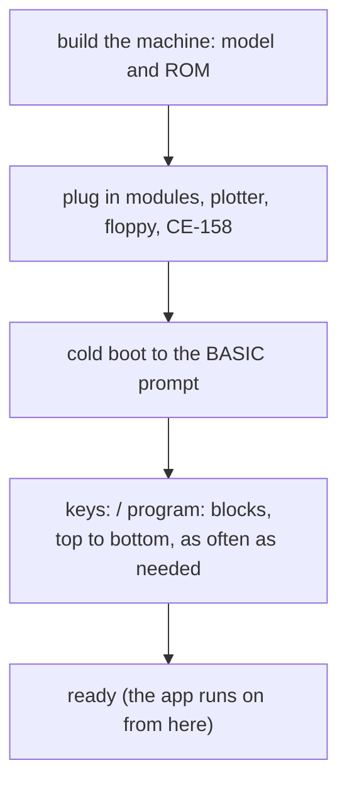
```mermaid
flowchart TD
    A["build the machine: model and ROM"] --> B["plug in modules, plotter, floppy, CE-158"]
    B --> C["cold boot to the BASIC prompt"]
    C --> D["keys: / program: blocks,<br/>top to bottom, as often as needed"]
    D --> E["ready (the app runs on from here)"]
```

It runs at full speed, and the window shows "Loading…" while it works.

### 8.2 The smallest preset

```yaml
model: PC-1500A
keys:
  - key: cl
  - type: NEW0
  - key: mode
  - type: PRINT "HELLO"
```

`model:` is required. `key:` presses one key by name. `type:` types a line,
followed by ENTER.

### 8.3 Adding hardware

```yaml
model: PC-1600:new            # PC-1500[:A01|A03|A04] | PC-1500A | PC-1600[:new|old]
plotter: ce1600p:new          # ce150 (all models) | ce1600p[:new|old] (PC-1600)
floppy: Formatted,A           # PC-1600 with ce1600p only: a disk by name, side A or B
memory-expansion-1:           # PC-1600 slot 1 (slot 2: memory-expansion-2:)
  - modulespec: CE-1600M      # a bundled or saved module, by name
```

- **PC-1500/1500A:** the one slot is `memory-expansion:`.
- **Your own module definition:** `- modulespecfile: my.card.yaml`, with the
  path relative to the preset.
- **CE-158:** `interface: ce158` attaches it (not yet together with the CE-1600P).

### 8.4 Loading a BASIC program

```yaml
model: PC-1600
keys:
  - key: mode
  - type: NEW0
program:
  path: hanoi.bas
  format: basic-binary        # converted and written straight into memory
keys:
  - key: mode
  - type: RUN
```

- **Before a `program:` block,** leave the machine in PRO mode after `NEW0`,
  as above. Switch to RUN mode afterwards.
- `format: basic-binary` works like **File ▸ Load BASIC Program…**
  ([chapter 4](#4-loading-a-basic-program)) and is fast.
- `format: basic-text` types the program line by line, the way you would.
  It's slow but works everywhere, and the program can sit in the preset
  itself:

  ```yaml
  program:
    format: basic-text
    text: |
      10 PRINT "HELLO"
      20 GOTO 10
  ```

### 8.5 Waiting

- `- wait: 2` runs two seconds of calculator time.
- A bare `- wait:` waits until the calculator is idle again, for example
  after a long program or plot:

```yaml
keys:
  - type: RUN
  - wait:
```

### 8.6 Machine code

```yaml
program:
  path: memtest_bank.bin
  format: binary
  address: 0x7C01             # needed if the file has no header
# slot: S0 | S1 | S2          # PC-1600: which memory the address is in
# length: 0x200               # load only part of the file
```

- **Files with a header** (PC-1600, CE-158) bring their own address.
- **Auto-run:** if the header has an auto-run address, the preset types
  `CALL` for you and waits until the code returns.
- **Examples:** `examples/memtest_bank.pc1500a`, and
  `examples/assembly/Calculat.pc1600` (which prepares a RAM disk first).

### 8.7 Other steps

| Step | What it does |
|---|---|
| `- saveas: s1:My card` | Name & Save the module in slot 1. `s2:` and `floppy:` are PC-1600 only. Overwrites a file of the same name. |
| `- screenshot: shot.png` | Saves the LCD image (as Copy Screen does) in the trace directory. |
| `- syncclock:` | Sets the calculator's clock from your computer. Put it last, because a preset runs at full speed and the clock runs ahead. |
| `- trace: run.bin` / `- trace: off` | Starts / stops a CPU trace (see the [Debug panel](#92-debug-panel)). |

A preset that prepares a card and saves it:
[examples/setup/make_diskworks_card.pc1600](../examples/setup/make_diskworks_card.pc1600).

### 8.8 Startup presets

**Settings ▸ Default presets** sets one preset per model. This is how a model
gets its usual setup, because a model switch starts with no modules and no
peripherals:

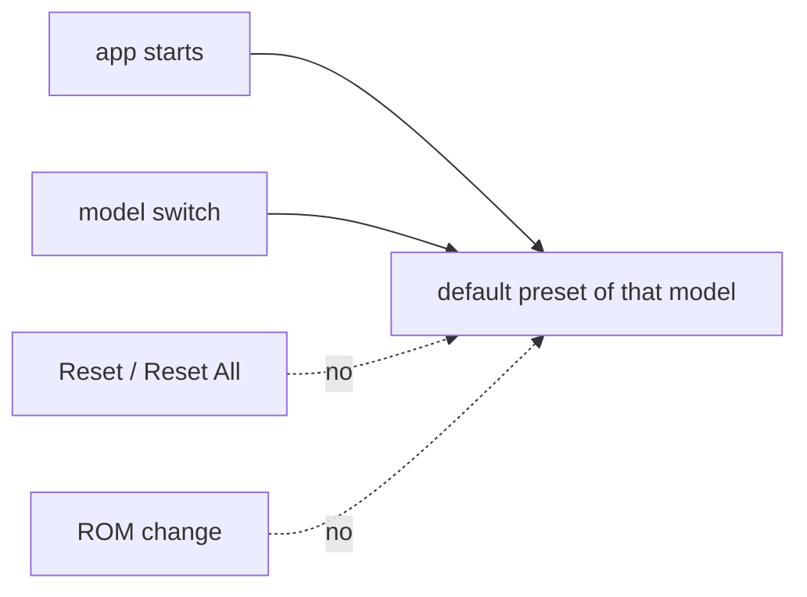
```mermaid
flowchart LR
    S["app starts"] --> P["default preset of that model"]
    M["model switch"] --> P
    R["Reset / Reset All"] -.->|no| P
    O["ROM change"] -.->|no| P
```

[examples/startup/default-pc1600.pc1600](../examples/startup/default-pc1600.pc1600)
is a complete example:
1. It attaches the CE-1600P with a formatted disk, a CE-1600M in slot 1 and a
   CE-1601M in slot 2.
2. It formats and splits the CE-1601M as a RAM disk
   (`INIT"S2:","F"`, `INIT"S2:","M"`).
3. It sets up `COM1:` as in [chapter 7](#7-com-ports).
4. It puts `SAVE"COM1:"@` and `LOAD"COM1:"@` on the F1/F2 keys.
5. It shows the free memory, then syncs the clock.

This is what it leaves on the LCD:

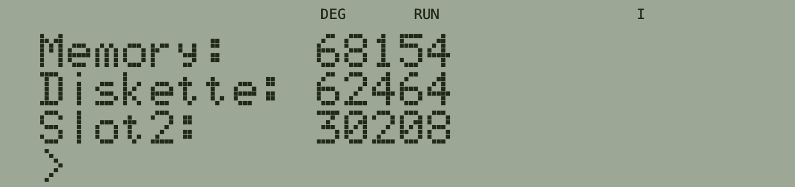

### 8.9 Reference

**Top-level keys**

| Key | Values |
|---|---|
| `model:` | `PC-1500[:A01\|A03\|A04]`, `PC-1500A`, `PC-1600[:new\|old]` (required) |
| `plotter:` | `ce150`, `ce1600p[:new\|old]` (PC-1600) |
| `interface:` | `ce158` |
| `floppy:` | disk name, optionally `,A` / `,B` (PC-1600 with `ce1600p`) |
| `memory-expansion:` | PC-1500/1500A: one `- modulespec: <name>` or `- modulespecfile: <path>` |
| `memory-expansion-1:`, `-2:` | PC-1600 slot 1 / slot 2, same form |
| `keys:` | a list of steps (below); may appear any number of times |
| `program:` | `format:`, `path:` or `text: \|`, `address:`, `slot:`, `length:`; may appear any number of times |

**Steps:** `key:`, `type:`, `wait:`, `saveas:`, `screenshot:`, `syncclock:`, `trace:`.

**`program:` formats:** `basic-binary` (alias `basic-tokenized`),
`basic-text`, `binary`.

**Key names for `key:`**
- A single letter, digit, or `+ - * / = ( ) .`.
- `enter`, `space`, `cl`, `mode`, `shift`, `def`, `sml`, `rcl`, `rsv`,
  `off`, `up`, `down`, `left`, `right`, `f1`–`f6`, and `on` (or `break`).
- The PC-1600-only keys `ctrl`, `kbii` and `bs` can't be pressed from a
  preset.

**Comments:** a `#` line is a comment, and ` # …` after a value is too. The
exception is `type:`, where everything is typed: a `#` in BASIC (`PRINT #1`)
must stay.

---

## 9. Appendix

### 9.1 Settings

**Calc-U-1600 ▸ Settings…** (⌘,) on macOS, **Edit ▸ Settings…** (Ctrl-,)
elsewhere. Changes apply immediately; there is only **Close**.

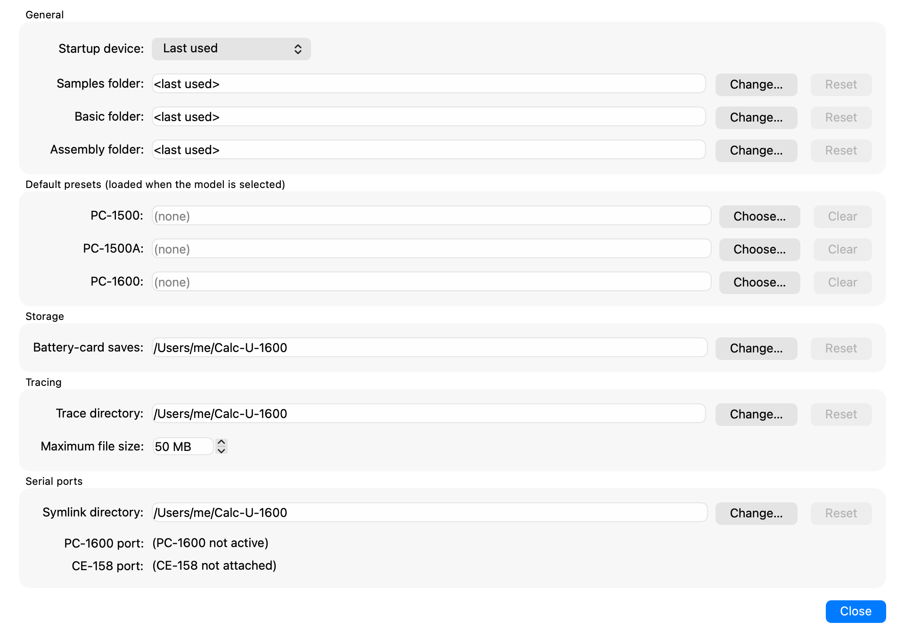

- **General**
  - **Startup device:** the model to start with: Last used, PC-1500 (ROM
    A04), PC-1500A or PC-1600.
  - **Samples / Basic / Assembly folder:** where Load Preset…, Load BASIC
    Program… and Load Machine Code… open. `<last used>` by default.
- **Default presets:** one per model, see [Startup presets](#88-startup-presets).
- **Storage ▸ Battery-card saves:** where saved modules and disks go.
- **Tracing:** where CPU traces go, and the size at which a trace stops.
- **Serial ports:** where the serial port files go, and their current paths
  (see [COM ports](#7-com-ports)).
- **Debugger:** lets VS Code attach on 127.0.0.1 at the given port (4711
  by default), with the server's current status (see
  [Debugger.md](Debugger.md)).


### 9.2 Debug panel

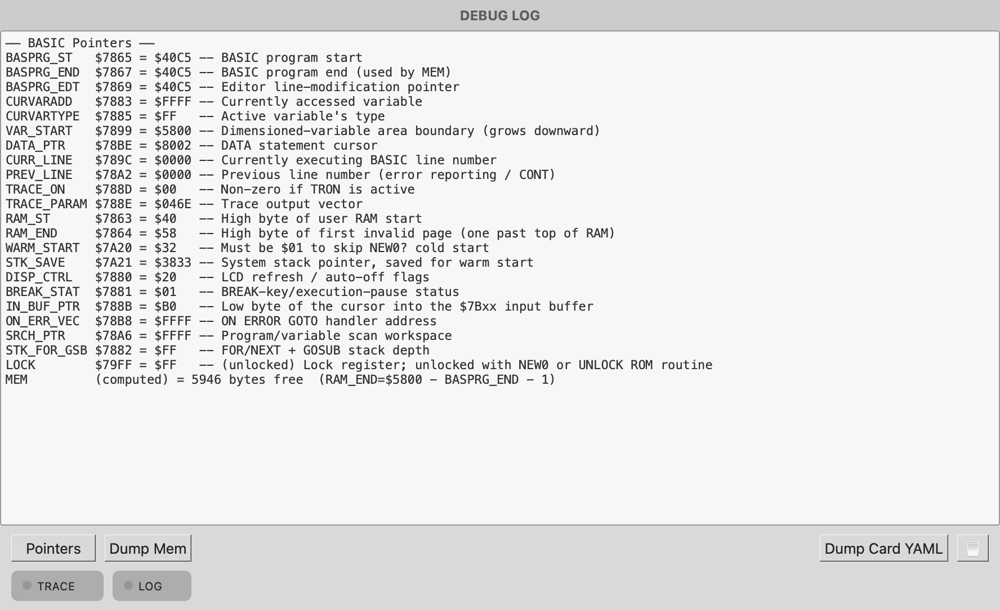

- **Pointers:** BASIC's pointer table (program start and end, RAM limits,
  free memory …) for the current model.
- **Dump Mem:** the interesting memory areas, skipping runs of filler bytes.
- **Dump Card YAML:** the module in the slot, as an `initial-content:` block
  for a `.card.yaml` (see below).
- **Clear** (bin icon): empties the log.
- **TRACE:** starts / stops a CPU instruction trace into the trace directory.

### 9.3 Custom memory cards

Every module is described by a `.card.yaml` file: which connector pins
enable it, what memory sits behind them, and optionally what it starts
with. The full reference is in
[Memory-Card-Definition-Spec.md](Memory-Card-Definition-Spec.md) (what and
why) and [Memory-Card-Definition-Format.md](Memory-Card-Definition-Format.md)
(every key).

- **Start from an example:** copy the closest bundled card from
  `Qt6/resources/cards/`. `ce155.card.yaml` is a simple one;
  `ce1638.card.yaml` and `ce1601m.card.yaml` are banked. The fictional
  [examples/memory-cards/pc1500-maxed-out.card.yaml](../examples/memory-cards/pc1500-maxed-out.card.yaml)
  shows every PC-1500 expansion pin in use, and its preset loads it with
  `modulespecfile:`.
- **Make it appear in the pickers:** put a file with `template: true` in
  the Battery-card saves folder. Like the bundled cards it is never written
  to, and Name & Save makes your own copy.
- **A card with content already on it:**
  1. Prepare it with a preset (see [examples/setup/](../examples/setup/)).
  2. Click **Dump Card YAML**.
  3. Paste the printed block into the card definition.

  If you only want to reuse one prepared card, Name & Save it instead and
  use it by name.
